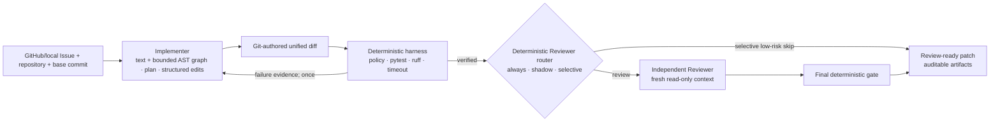

# PRGuard

[](https://github.com/Suxingyeme1/prguard/actions/workflows/ci.yml)
[](https://www.python.org/)
[](LICENSE)

> Issue in. Verified patch out.

PRGuard is a verifiable multi-agent coding system for real repositories. An Implementer turns an
Issue into a patch, an Independent Reviewer checks the change in a separate read-only context, and
a deterministic harness owns execution, timeouts, policy gates, regression checks, and delivery.

The result is not just model output. Every accepted change is tied to an exact base commit, a
unified diff, command evidence, structured decisions, and a SHA-256 manifest.



## Why this project

Coding agents are useful when they can change a real repository, but their claims should not decide
whether their own work is correct. PRGuard separates proposal from judgment:

- the model navigates bounded repository content with text and Python AST tools, then proposes
  exact text edits (or a compatibility Patch fallback);
- PRGuard applies structured edits in an isolated worktree and asks Git to produce the diff;
- the harness applies that patch in an isolated worktree and runs only declared argv commands;
- changed Python test modules are deterministically added to the pytest gate, so an Agent-authored
  regression test cannot sit outside a narrowly selected original test target;
- one failed verification can return structured evidence for a bounded replacement patch;
- a versioned deterministic router can run every review, shadow a selective recommendation, or
  explicitly skip only a completely analyzed low-risk Fix;
- review uses an independent context and produces source-linked findings;
- the final gate and artifact hashes are deterministic and replayable.

PRGuard currently exposes two product entries:

```text
prguard fix     repository + base commit + Issue -> tested patch
prguard review  frozen FixTask + candidate patch -> findings + optional repair
```

Planner remains an internal Implementer step. The test runner is deliberately a deterministic tool,
not another Agent.

## Try it offline

Requirements: Git, Python 3.12, and [uv](https://docs.astral.sh/uv/). No model key or network call is
needed for this demo.

```bash
uv sync --extra dev --no-editable --reinstall-package prguard
uv run python scripts/run_offline_demo.py
```

The demo materializes a tiny Git repository, submits an intentionally incomplete first patch,
returns the pytest failure to a scripted Implementer, applies one replacement patch, and verifies
the resulting recursive manifest. It prints the final patch and artifact directory.

For the online real-repository walkthrough, use
[Demo A: Humanize #366](docs/demo-a.md). It freezes the public Issue and Base Commit, discovers a
conservative verification profile, runs DeepSeek with visible progress, and retains the complete
failure/success evidence chain.

## Start from a public GitHub Issue

`fix` accepts either a reviewed Task JSON or a canonical public GitHub Issue URL. The URL form
freezes the Issue and exact commit, checks out the repository, discovers a conservative Python
verification profile, preserves the generated Task/Manifest, and continues into implementation:

```bash
uv run prguard fix \
  https://github.com/python-humanize/humanize/issues/366 \
  --workspace work/humanize-366 \
  --base-commit ce4147b6c8f8a132f772be0929d58305eb22c5d9 \
  --trust-host \
  --provider deepseek \
  --progress
```

Use the two-stage form when a person or CI policy should inspect preparation before spending model
tokens or running repository code:

```bash
uv run prguard prepare-github ISSUE_URL \
  --output work/humanize-366 --trust-host

uv run prguard verify-manifest \
  work/humanize-366/artifacts/preparation-manifest.json

uv run prguard fix work/humanize-366/artifacts/task.json \
  --provider openai --progress
```

The one-command workspace contains the same preparation artifacts plus `fix-runs/`. Omit
`--base-commit` to freeze the default-branch tip at preparation time. Unknown repositories
must explicitly select `--trust-host` or a digest-pinned `--container-image`; the model never makes
that trust decision. See the [GitHub onboarding guide](docs/github-onboarding.md), including the
optional reviewed `.prguard.toml` contract.

The same frozen Task can go directly into independent review without copying its repository,
commit, Issue, or command fields:

```bash
uv run prguard review work/humanize-366/artifacts/task.json \
  --candidate-patch path/to/final.patch \
  --provider deepseek
```

Add `--repair` to permit one controlled repair under the FixTask's original writable/size policy.

The composed `fix --review` path defaults to reviewing every accepted Fix. Use shadow mode to
measure the selective policy while still running the Reviewer:

```bash
uv run prguard fix work/humanize-366/artifacts/task.json \
  --provider openai \
  --review \
  --review-policy shadow \
  --review-provider deepseek
```

`--review-policy selective` makes a low-risk `skip` recommendation effective. It remains explicit:
analysis gaps, changed tests/gates, sensitive or unsupported source, dependency/build changes, an
Implementer repair round, uncovered reachable tests, broad changes, and high static fan-in all
retain Independent Review. The default is `always`; the standalone `review` command never routes.

Inspect the same frozen Base Commit without calling a model or executing repository code:

```bash
uv run prguard inspect-symbol work/humanize-366/artifacts/task.json \
  --symbol humanize.filesize.naturalsize \
  --direction both \
  --max-depth 2
```

The command creates a short-lived detached worktree and returns bounded static nodes, edges,
resolution evidence, and reachable/related public tests as JSON.

Run the complete quality gate:

```bash
uv sync --extra dev --extra agent --no-editable --reinstall-package prguard
uv run ruff check --no-fix src tests scripts
uv run pytest -q
```

## What is implemented

- public GitHub Issue onboarding, exact commit resolution, safe checkout, and replayable preparation
  artifacts;
- reviewed `.prguard.toml` profiles plus conservative pytest, Issue-related public-test, source
  scope, and declared Hatch VCS runtime-file discovery; lint gates are explicit policy;
- bounded text tools plus Python AST symbol/import/reference, direct-call queries, one-to-three-hop
  static call-graph tracing, and related/reachable-test navigation;
- exact `replace_text`/`create_file` submissions applied locally, with Git-authored Patch output;
- compatibility unified-diff proposals with writable/protected path, file-count, and byte limits;
- detached Git worktree execution at an exact base commit;
- strict `pytest` and non-mutating `ruff check --no-fix` argv grammars with `shell=False`;
- per-command, per-stage, and total-run deadlines with bounded captured output;
- zero-token pytest collection and non-pytest Base-gate readiness checks before Implementer calls;
- Harness-derived `pytest -q <changed-test-files...>` execution after Patch application; changing
  tests without a declared pytest capability is policy-blocked;
- optional digest-pinned container verification with no network, read-only mounts, and resource
  limits;
- structured pytest/ruff results, policy decisions, review findings, and trace events;
- one evidence-guided implementation repair and one review-triggered controlled repair;
- deterministic post-Fix Reviewer routing with backwards-compatible `always`, measurement-only
  `shadow`, and explicit fail-closed `selective` modes;
- provider-neutral scripted, DeepSeek Chat Completions, and OpenAI Responses adapters;
- provider failures retain non-secret partial tool/Token evidence, and terminal submission has a
  reserved slot outside the bounded read-tool budget;
- recursive JSON/Markdown artifacts, final diff, and SHA-256 manifest verification;
- one-command GitHub-URL `fix`, inspectable `prepare-github`, `inspect-symbol`, `review`, `run`,
  `replay`, and `verify-manifest` CLI workflows.

## Evidence on real repositories

Three manually checked public issues were frozen at exact upstream commits and exercised end to end.
These are engineering case studies, not a claim of broad benchmark generalization.

| Repository | Issue | Selected patch | Wider regression check |
| --- | --- | --- | --- |
| Humanize | [#366](https://github.com/python-humanize/humanize/issues/366) | accepted with two structured edits; pytest + ruff | 702 passed, 74 skipped* |
| PrettyTable | [#474](https://github.com/prettytable/prettytable/issues/474) | accepted with source + regression-test edits | 339 passed |
| Inflect | [#242](https://github.com/jaraco/inflect/issues/242) | accepted | 208 passed, 16 xfailed |

\* Optional benchmark tests were excluded because their plugin was unavailable.

The private frozen run set intentionally retains failures too: a provider timeout, malformed
patches, a tool-budget exhaustion, and the successful Humanize repair cycle. The public repository
contains a path-free [case report](evidence/real-repositories/README.md), selected patches, and a
machine-verifiable [evidence manifest](evidence/real-repositories/manifest.json).

The v0.8.1 [navigation-hardening case](evidence/navigation-hardening/README.md) retains the
PrettyTable failure-to-design chain, accepted live Patch, 22-test targeted gate, 339-test wider
gate, path-free run summary, and hashes. The public Issue disclosed the root cause, so this evidence
tests repository navigation, adaptation, and orchestration—not blind semantic diagnosis.

The v0.8.2 [call-graph check](evidence/call-graph-hardening/README.md) deterministically traces the
same frozen PrettyTable source from `from_html` to upstream callers, downstream dependencies, and
three reachable tests. It demonstrates bounded static navigation without executing repository code;
it does not claim runtime-complete dispatch resolution.

A separate two-case [Reviewer value check](evidence/reviewer-value/README.md) records one regression
that passed a narrow base gate but was caught and repaired by independent review, plus one accepted
Humanize Patch that was not false-blocked but incurred substantial review latency. It supports
selective review, not a general accuracy claim.

The v0.9.0 [selective-routing shadow check](evidence/selective-routing/README.md) replays two
source-only accepted changes at frozen PrettyTable and Humanize commits. PrettyTable passed 21
targeted and 338 wider tests and received a `skip` recommendation; Humanize passed 76 targeted plus
700 wider tests and Ruff but retained `review` because a reachable i18n test was outside the
targeted gate. This is a two-case policy check, not a false-skip estimate.

## Live model run

Install the optional provider dependency and keep the API key in the process environment:

```bash
uv sync --extra agent --extra dev --no-editable --reinstall-package prguard
export DEEPSEEK_API_KEY='...'
uv run prguard fix work/materialized-fix-fixtures/direct-success/task.json \
  --provider deepseek \
  --model deepseek-v4-pro \
  --reasoning-effort high \
  --progress \
  --artifacts work/deepseek-live-artifacts
unset DEEPSEEK_API_KEY
```

Materialize that fixture first with
`uv run python scripts/materialize_fix_fixtures.py --output work/materialized-fix-fixtures`.
Read the [live-provider runbook](docs/live-provider-runbook.md) before sending non-fixture source.

## Trust boundary

PRGuard provides strict process orchestration and post-execution write detection. Trusted tasks may
use the default host executor; higher-risk tasks can opt into
[container-backed verification](docs/container-execution.md) with a digest-pinned image, no
network, read-only mounts, non-root execution, and hard resource limits. This is defense in depth,
not protection from a malicious image, Docker daemon, container-runtime exploit, or host-kernel
vulnerability. Model access is bounded, but repository bytes requested through read tools are sent
to the selected provider.

See the [threat model](docs/threat-model.md) and [security policy](SECURITY.md) before using real
source code.

## Project map

| Path | Purpose |
| --- | --- |
| `src/prguard/onboarding` | GitHub Issue freezing, safe checkout, project-policy discovery |
| `src/prguard/implementer` | text/AST navigation, structured edits, patch policy, providers |
| `src/prguard/fix` | Issue-to-Patch orchestration and artifacts |
| `src/prguard/reviewer` | independent read-only Reviewer providers |
| `src/prguard/review` | review and controlled-repair orchestration |
| `src/prguard/pipeline` | complete Issue-to-PR composition |
| `src/prguard/harness` | Git/worktree, command policy, execution, artifacts |
| `src/prguard/schemas` | versioned public contracts |
| `benchmark` | checked deterministic fixture templates |
| `tests` | unit, integration, contract, and security tests |
| `docs` | architecture, ADRs, runbooks, evaluation protocol |

Start with the [architecture](docs/architecture.md), [milestones](docs/milestones.md), and
[contribution guide](CONTRIBUTING.md).

## Current boundary and roadmap

Version 0.9.0 adds deterministic Reviewer routing after an accepted Fix. `always` preserves the
existing quality posture, `shadow` records what a selective policy would do while still reviewing,
and explicit `selective` can avoid provider construction for a fully analyzed low-risk Patch. The
decision binds the exact Base Commit, Patch, Fix Manifest, and verification Manifest and is hashed
into the top-level Artifact set; see the [v0.9.0 phase report](docs/v0.9.0-phase-report.md) and
[ADR 0018](docs/adr/0018-reviewer-routing-is-deterministic-shadowable-and-fail-closed.md). The next
priority is a larger manually labelled shadow set across repositories before considering selective
as a repository default. Large benchmark infrastructure and extra Agent roles remain intentionally
deferred.

PRGuard is research-grade software under active development. Accepted means “passed the declared
gate at the frozen commit,” not “proved correct for every environment.”
