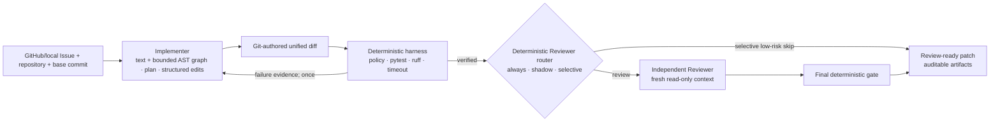

# PRGuard

[](https://github.com/Suxingyeme1/prguard/actions/workflows/ci.yml)
[](https://www.python.org/)
[](LICENSE)

> Issue in. Verified patch out.

PRGuard is a verifiable multi-agent coding system for real repositories. An Implementer turns an
Issue into a patch, an Independent Reviewer checks the change in a separate read-only context, and
a deterministic harness owns execution, timeouts, policy gates, regression checks, and delivery.

The result is not just model output. Every accepted change is tied to an exact base commit, a
unified diff, command evidence, structured decisions, and a SHA-256 manifest.



## Why this project

Coding agents are useful when they can change a real repository, but their claims should not decide
whether their own work is correct. PRGuard separates proposal from judgment:

- the model navigates bounded repository content with text and Python AST tools, then proposes
  exact text edits (or a compatibility Patch fallback);
- PRGuard applies structured edits in an isolated worktree and asks Git to produce the diff;
- the harness applies that patch in an isolated worktree and runs only declared argv commands;
- changed Python test modules are deterministically added to the pytest gate, so an Agent-authored
  regression test cannot sit outside a narrowly selected original test target;
- one failed verification can return structured evidence for a bounded replacement patch;
- a versioned deterministic router can run every review, shadow a selective recommendation, or
  explicitly skip only a completely analyzed low-risk Fix;
- review uses an independent context and produces source-linked findings;
- the final gate and artifact hashes are deterministic and replayable.

PRGuard currently exposes two product entries:

```text
prguard fix     repository + base commit + Issue -> tested patch
prguard review  frozen FixTask + candidate patch -> findings + optional repair
```

Planner remains an internal Implementer step. The test runner is deliberately a deterministic tool,
not another Agent.

## See the pipeline in one command

```bash
uv run --extra demo prguard demo
```

The dependency-free terminal view creates a disposable Git repository and shows the complete
failure-to-repair path: frozen Commit, structured Implementer edit, fixed pytest command, first
failure, evidence feedback, successful repair, final Patch, and Manifest. It uses the real FixRunner
and Harness but scripted model responses, so the walkthrough is stable and needs no API key. See the
[terminal demo guide](docs/terminal-demo.md).

For local work, Task JSON is optional. PRGuard can freeze a clean repository and natural-language
Issue directly:

```bash
uv run prguard start --repository /path/to/project
```

The guided terminal asks for the Issue, shows the requested and resolved Git version, previews the
exact verification commands and edit/protected scopes, requires an explicit host/container choice,
and starts only after confirmation. For automation, the equivalent non-interactive entry is:

```bash
uv run prguard fix \
  "Fix add() so it returns the sum of both operands." \
  --repository /path/to/project \
  --workspace /path/to/prguard-runs/add-fix \
  --base-commit HEAD \
  --trust-host \
  --provider deepseek \
  --progress
```

Use `--issue-file issue.md` for longer requirements, or `prepare-local` to inspect the generated
Task and Manifest before execution. The workspace must stay outside the source repository. See the
[local onboarding guide](docs/local-onboarding.md).

Before running an unfamiliar project, inspect the deterministic gate and edit boundary without a
model call or test execution:

```bash
uv run prguard inspect-policy \
  --repository /path/to/project \
  --issue-file /path/to/issue.md \
  --base-commit HEAD
```

The JSON report either returns `ready` with the exact pytest/Ruff argv and a reviewable
`.prguard.toml` candidate, or `needs_config` with a blocking reason. PRGuard does not invent a test
command for an unsupported repository. For an upstream repository that cannot be modified, pass a
reviewed local policy without hand-editing Task JSON:

```bash
uv run prguard inspect-policy \
  --repository /path/to/project \
  --issue-file /path/to/issue.md \
  --policy-file /path/to/prguard-policy.toml
```

The same `--policy-file` works with `start`, `fix`, `prepare-local`, and `prepare-github`. Its
validated values are frozen into the preparation Manifest, and it cannot override a repository's
own `.prguard.toml`.

## Try it offline

Requirements: Git, Python 3.12, and [uv](https://docs.astral.sh/uv/). No model key or network call is
needed for this demo.

```bash
uv sync --extra dev --no-editable --reinstall-package prguard
uv run python scripts/run_offline_demo.py
```

The demo materializes a tiny Git repository, submits an intentionally incomplete first patch,
returns the pytest failure to a scripted Implementer, applies one replacement patch, and verifies
the resulting recursive manifest. It prints the final patch and artifact directory.

For the online real-repository walkthrough, use
[Demo A: Humanize #366](docs/demo-a.md). It freezes the public Issue and Base Commit, discovers a
conservative verification profile, runs DeepSeek with visible progress, and retains the complete
failure/success evidence chain.

## Start from a public GitHub Issue

`fix` accepts either a reviewed Task JSON or a canonical public GitHub Issue URL. The URL form
freezes the Issue and exact commit, checks out the repository, discovers a conservative Python
verification profile, preserves the generated Task/Manifest, and continues into implementation:

```bash
uv run prguard fix \
  https://github.com/python-humanize/humanize/issues/366 \
  --workspace work/humanize-366 \
  --base-commit ce4147b6c8f8a132f772be0929d58305eb22c5d9 \
  --trust-host \
  --provider deepseek \
  --progress
```

Use the two-stage form when a person or CI policy should inspect preparation before spending model
tokens or running repository code:

```bash
uv run prguard prepare-github ISSUE_URL \
  --output work/humanize-366 --trust-host

uv run prguard verify-manifest \
  work/humanize-366/artifacts/preparation-manifest.json

uv run prguard fix work/humanize-366/artifacts/task.json \
  --provider openai --progress
```

The one-command workspace contains the same preparation artifacts plus `fix-runs/`. Omit
`--base-commit` to freeze the default-branch tip at preparation time. Unknown repositories
must explicitly select `--trust-host` or a digest-pinned `--container-image`; the model never makes
that trust decision. See the [GitHub onboarding guide](docs/github-onboarding.md), including the
optional reviewed `.prguard.toml` contract.

The same frozen Task can go directly into independent review without copying its repository,
commit, Issue, or command fields:

```bash
uv run prguard review work/humanize-366/artifacts/task.json \
  --candidate-patch path/to/final.patch \
  --provider deepseek
```

Add `--repair` to permit one controlled repair under the FixTask's original writable/size policy.

The composed `fix --review` path defaults to reviewing every accepted Fix. Use shadow mode to
measure the selective policy while still running the Reviewer:

```bash
uv run prguard fix work/humanize-366/artifacts/task.json \
  --provider openai \
  --review \
  --review-policy shadow \
  --review-provider deepseek
```

`--review-policy selective` makes a low-risk `skip` recommendation effective. It remains explicit:
analysis gaps, changed tests/gates, sensitive or unsupported source, dependency/build changes, an
Implementer repair round, uncovered reachable tests, broad changes, and high static fan-in all
retain Independent Review. The default is `always`; the standalone `review` command never routes.

Inspect the same frozen Base Commit without calling a model or executing repository code:

```bash
uv run prguard inspect-symbol work/humanize-366/artifacts/task.json \
  --symbol humanize.filesize.naturalsize \
  --direction both \
  --max-depth 2
```

The command creates a short-lived detached worktree and returns bounded static nodes, edges,
resolution evidence, and reachable/related public tests as JSON.

Run only the deterministic gate—without calling either Agent—and record the actual Python runtime:

```bash
python3.12 -m prguard.cli gate work/locust-3207/artifacts/task.json \
  --candidate-patch path/to/candidate.patch \
  --artifacts work/gates/python312

python3.13 -m prguard.cli gate work/locust-3207/artifacts/task.json \
  --candidate-patch path/to/candidate.patch \
  --artifacts work/gates/python313
```

Each result carries implementation, version, cache tag, platform, architecture, and
host/container provenance. PRGuard records those lanes independently; it does not silently create
environments or install target dependencies.

Run the complete quality gate:

```bash
uv sync --extra dev --extra agent --no-editable --reinstall-package prguard
uv run --no-sync ruff check --no-fix src tests scripts
uv run --no-sync pytest -q
```

## What is implemented

- public GitHub Issue onboarding, exact commit resolution, safe checkout, and replayable preparation
  artifacts;
- reviewed repository `.prguard.toml` or explicit local `--policy-file` profiles plus conservative
  pytest, unique nested-test-root, Issue-related public-test, source-scope, and declared Hatch VCS
  runtime-file discovery; lint gates are explicit policy;
- bounded text tools plus Python AST symbol/import/reference, direct-call queries, one-to-three-hop
  static call-graph tracing, and related/reachable-test navigation;
- exact text, hash-guarded line-range/Python-symbol, and bounded file-creation edits applied
  locally, with Git-authored Patch output;
- compatibility unified-diff proposals with writable/protected path, file-count, and byte limits;
- detached Git worktree execution at an exact base commit;
- strict `pytest` and non-mutating `ruff check --no-fix` argv grammars with `shell=False`;
- per-command, per-stage, and total-run deadlines with bounded captured output;
- model-free `gate` replay from a frozen FixTask, with runtime identity in every command artifact;
- zero-token pytest collection and non-pytest Base-gate readiness checks before Implementer calls;
- Harness-derived `pytest -q <changed-test-files...>` execution after Patch application; changing
  tests without a declared pytest capability is policy-blocked;
- candidate-authored executable test changes must fail against a fresh unchanged Base worktree
  before joining the final gate; AST-equivalent comment/format-only changes are not misclassified;
- optional digest-pinned container verification with no network, read-only mounts, and resource
  limits;
- structured pytest/ruff results, policy decisions, review findings, and trace events;
- one evidence-guided implementation repair and one review-triggered controlled repair;
- deterministic post-Fix Reviewer routing with backwards-compatible `always`, measurement-only
  `shadow`, and explicit fail-closed `selective` modes;
- provider-neutral scripted, DeepSeek Chat Completions, and OpenAI Responses adapters;
- provider failures retain non-secret partial tool/Token evidence, and terminal submission has a
  reserved slot outside the bounded read-tool budget;
- recursive JSON/Markdown artifacts, final diff, and SHA-256 manifest verification;
- one-command GitHub-URL `fix`, inspectable `prepare-github`, `inspect-symbol`, `review`, `run`,
  `replay`, and `verify-manifest` CLI workflows.

## Evidence on real repositories

Three manually checked public issues were frozen at exact upstream commits and exercised end to end.
These are engineering case studies, not a claim of broad benchmark generalization.

| Repository | Issue | Selected patch | Wider regression check |
| --- | --- | --- | --- |
| Humanize | [#366](https://github.com/python-humanize/humanize/issues/366) | accepted with two structured edits; pytest + ruff | 702 passed, 74 skipped* |
| PrettyTable | [#474](https://github.com/prettytable/prettytable/issues/474) | declared gate accepted; later independent review found a multi-table regression | 339 existing tests passed; evaluator check failed |
| Inflect | [#242](https://github.com/jaraco/inflect/issues/242) | accepted | 208 passed, 16 xfailed |

\* Optional benchmark tests were excluded because their plugin was unavailable.

The private frozen run set intentionally retains failures too: a provider timeout, malformed
patches, a tool-budget exhaustion, and the successful Humanize repair cycle. The public repository
contains a path-free [case report](evidence/real-repositories/README.md), selected patches, and a
machine-verifiable [evidence manifest](evidence/real-repositories/manifest.json).

The v0.8.1 [navigation-hardening case](evidence/navigation-hardening/README.md) retains the
PrettyTable failure-to-design chain, accepted live Patch, 22-test targeted gate, 339-test wider
gate, path-free run summary, and hashes. The public Issue disclosed the root cause, so this evidence
tests repository navigation, adaptation, and orchestration—not blind semantic diagnosis.

The v0.8.2 [call-graph check](evidence/call-graph-hardening/README.md) deterministically traces the
same frozen PrettyTable source from `from_html` to upstream callers, downstream dependencies, and
three reachable tests. It demonstrates bounded static navigation without executing repository code;
it does not claim runtime-complete dispatch resolution.

The fresh [Locust #3207 holdout](evidence/locust-3207-holdout/README.md) exercises a non-standard
test tree and a Python-version-specific failure. A reviewed operator policy is frozen without
changing upstream source; the same public gate passes under recorded CPython 3.12 and 3.13
runtimes, while a pre-run sealed evaluator commitment distinguishes the failing 3.13 Base. The live
Implementer and Reviewer observations remain pending.

A small [Reviewer value check](evidence/reviewer-value/README.md) now records three confirmed
incremental findings plus clean-review cost. The blocking real-repository finding is on the exact PrettyTable Patch
that passed 21 targeted and 338 wider existing tests: Reviewer evidence exposed a multi-table
regression that a paired Base/Candidate check confirmed. One controlled repair then passed 23
targeted and all 340 repository tests. The exact source-only Humanize review was not false-blocked;
it reported a nonblocking test gap and incurred substantial latency.

The v0.9.0 [selective-routing shadow check](evidence/selective-routing/README.md) replays two
source-only Harness-accepted changes at frozen PrettyTable and Humanize commits. PrettyTable passed
21 targeted and 338 wider existing tests and received a `skip` recommendation; the later paired
Review/evaluator check reclassified it as defective. Humanize passed 76 targeted plus 700 wider
tests and Ruff but retained `review` because a reachable i18n test was outside the targeted gate.

The v0.10.2 [hash-bound Shadow scorecard](evidence/shadow-scorecard/README.md) joins the routes,
post-run evaluator checks, and Reviewer records only when Base Commit and candidate Patch hashes
match. It derives False Route 1/1, False Skip 1/2, False Block 0/1, paired Reviewer coverage 3/3,
and three confirmed incremental findings. Selective activation remains **not ready** because the
frozen policy has an observed False Skip.

The v0.10.3 [routing-v2 corrective replay](evidence/review-routing-v2/README.md) adds one bounded
AST signal for changed factories that directly return nested classes with cross-method instance
state. It changes the known defective PrettyTable route from `skip` 0/5 to `review` 5/5 without
changing the other two frozen recommendations. This is a post-failure regression check, not
held-out evidence, so selective activation remains **not ready**.

The v0.10.4 [holdout and correction record](evidence/review-routing-v3-holdout/README.md) adds two
evaluator-confirmed clean real-repository Patches. Both v2 Reviews accepted with zero findings,
adding 303.6 seconds and 405,253 input/output tokens in aggregate. The python-dotenv run exposed a
full-suite accounting bug: 217 tests had run, but v2 still marked related tests uncovered.
`review-routing-v3` changes that exact route from `review` 7/5 to `skip` 0/5 and preserves the other
four replayed decisions. It also defers repair-provider construction until Review actually requests
changes. Selective activation remains **not ready** because the set contains no new held-out defect.

The v0.10.5 [routing-v4 validation](evidence/review-routing-v4-validation/README.md) adds a real
defective Click Pull Request. Its full 1323-test suite and 9 changed-test replays passed, but the
Independent Reviewer identified a public `Context.lookup_default()` extension-point regression that
an evaluator-only Base/Candidate check confirmed. Both v3 and v4 route it to Review; v4 additionally
fixes command-scope accounting so the later targeted replay cannot overwrite the earlier full-suite
fact. The clean python-dotenv #600 route remains `skip` 0/5. Selective activation is still **not
ready** because this is a two-case validation, not a calibrated deployment set.

The v0.10.6 [controlled-repair record](evidence/click-controlled-repair/README.md) closes that real
Click path: a fresh Implementer received the frozen P2 finding, made four structured edits, and
produced a replacement Patch that passed 1324 full-suite tests and 10 changed-test replays. A hidden
Base/Candidate/Repaired evaluator confirmed the public Context override works before the candidate,
fails on it, and works again after repair. No evaluator, maintainer outcome, later upstream fix, or
Gold Patch was visible to the repair Agent.

The [FileLock #606 holdout](evidence/filelock-606-holdout/README.md) adds a fourth repository shape
without inflating the success count: policy discovery and the clean 539-test Base gate are frozen,
while the live Implementer outcome remains explicitly pending. The upstream repair and evaluator
material are not part of the Agent-facing task or public evidence package.

## Live model run

Install the optional provider dependency and keep the API key in the process environment:

```bash
uv sync --extra agent --extra dev --no-editable --reinstall-package prguard
export DEEPSEEK_API_KEY='...'
uv run prguard fix work/materialized-fix-fixtures/direct-success/task.json \
  --provider deepseek \
  --model deepseek-v4-pro \
  --reasoning-effort high \
  --progress \
  --artifacts work/deepseek-live-artifacts
unset DEEPSEEK_API_KEY
```

Materialize that fixture first with
`uv run python scripts/materialize_fix_fixtures.py --output work/materialized-fix-fixtures`.
Read the [live-provider runbook](docs/live-provider-runbook.md) before sending non-fixture source.

## Trust boundary

PRGuard provides strict process orchestration and post-execution write detection. Trusted tasks may
use the default host executor; higher-risk tasks can opt into
[container-backed verification](docs/container-execution.md) with a digest-pinned image, no
network, read-only mounts, non-root execution, and hard resource limits. This is defense in depth,
not protection from a malicious image, Docker daemon, container-runtime exploit, or host-kernel
vulnerability. Model access is bounded, but repository bytes requested through read tools are sent
to the selected provider.

See the [threat model](docs/threat-model.md) and [security policy](SECURITY.md) before using real
source code.

## Project map

| Path | Purpose |
| --- | --- |
| `src/prguard/onboarding` | GitHub/local Issue freezing, safe checkout, project-policy discovery |
| `src/prguard/implementer` | text/AST navigation, structured edits, patch policy, providers |
| `src/prguard/fix` | Issue-to-Patch orchestration and artifacts |
| `src/prguard/reviewer` | independent read-only Reviewer providers |
| `src/prguard/review` | review and controlled-repair orchestration |
| `src/prguard/pipeline` | complete Issue-to-PR composition |
| `src/prguard/harness` | Git/worktree, command policy, execution, artifacts |
| `src/prguard/schemas` | versioned public contracts |
| `src/prguard/evaluation` | post-run evaluator-only joins and scorecards |
| `benchmark` | checked deterministic fixture templates |
| `tests` | unit, integration, contract, and security tests |
| `docs` | architecture, ADRs, runbooks, evaluation protocol |

Start with the [architecture](docs/architecture.md), [milestones](docs/milestones.md), and
[contribution guide](CONTRIBUTING.md).

## Current boundary and roadmap

Version 0.13.4 makes the guided terminal delivery directly reviewable with per-attempt verification,
runtime, bounded Patch preview, and copyable Git validation output. Version 0.13.3 added reviewed
local policy files for immutable upstream repositories, model-free `gate` replay, nested Python
test-root discovery, and runtime-attributed command artifacts. A fresh Locust #3207 holdout is
frozen with passing public gates on CPython 3.12/3.13 and a sealed version-specific evaluator; no
live task-resolution result is claimed yet. See the
[v0.13.3 phase report](docs/v0.13.3-phase-report.md),
[v0.13.2 phase report](docs/v0.13.2-phase-report.md),
[v0.13.1 phase report](docs/v0.13.1-phase-report.md),
[guided terminal guide](docs/local-onboarding.md),
[v0.11.1 phase report](docs/v0.11.1-phase-report.md),
[local onboarding guide](docs/local-onboarding.md),
[ADR 0023](docs/adr/0023-local-issues-freeze-before-agent-execution.md), and
[controlled-repair evidence](evidence/click-controlled-repair/README.md), and
[FileLock holdout evidence](evidence/filelock-606-holdout/README.md). FileLock #606 remains an
honest false accept and is not reused to claim improvement. The next priority is the uncontaminated
Locust live Implementer/Reviewer/evaluator sequence—not another Agent role.

PRGuard is research-grade software under active development. Accepted means “passed the declared
gate at the frozen commit,” not “proved correct for every environment.”
