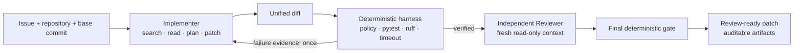

# PRGuard

> Issue in. Verified patch out.

PRGuard is a verifiable multi-agent coding system for real repositories. An Implementer turns an
Issue into a patch, an Independent Reviewer checks the change in a separate read-only context, and
a deterministic harness owns execution, timeouts, policy gates, regression checks, and delivery.

The result is not just model output. Every accepted change is tied to an exact base commit, a
unified diff, command evidence, structured decisions, and a SHA-256 manifest.



## Why this project

Coding agents are useful when they can change a real repository, but their claims should not decide
whether their own work is correct. PRGuard separates proposal from judgment:

- the model searches bounded repository content and proposes a complete Git patch;
- the harness applies that patch in an isolated worktree and runs only declared argv commands;
- one failed verification can return structured evidence for a bounded replacement patch;
- review uses an independent context and produces source-linked findings;
- the final gate and artifact hashes are deterministic and replayable.

PRGuard currently exposes two product entries:

```text
prguard fix     repository + base commit + Issue -> tested patch
prguard review  repository + Issue + candidate patch -> findings + optional repair
```

Planner remains an internal Implementer step. The test runner is deliberately a deterministic tool,
not another Agent.

## Try it offline

Requirements: Git, Python 3.12, and [uv](https://docs.astral.sh/uv/). No model key or network call is
needed for this demo.

```bash
uv sync --extra dev --no-editable --reinstall-package prguard
uv run python scripts/run_offline_demo.py
```

The demo materializes a tiny Git repository, submits an intentionally incomplete first patch,
returns the pytest failure to a scripted Implementer, applies one replacement patch, and verifies
the resulting recursive manifest. It prints the final patch and artifact directory.

Run the complete quality gate:

```bash
uv run ruff check src tests scripts
uv run pytest -q
```

## What is implemented

- bounded `list_files`, `search_text`, and `read_file` repository tools;
- complete unified-diff proposals with writable/protected path, file-count, and byte limits;
- detached Git worktree execution at an exact base commit;
- strict `pytest` and `ruff` argv grammars with `shell=False`;
- per-command, per-stage, and total-run deadlines with bounded captured output;
- structured pytest/ruff results, policy decisions, review findings, and trace events;
- one evidence-guided implementation repair and one review-triggered controlled repair;
- provider-neutral scripted, DeepSeek Chat Completions, and OpenAI Responses adapters;
- recursive JSON/Markdown artifacts, final diff, and SHA-256 manifest verification;
- `fix`, `review`, `run`, `replay`, and `verify-manifest` CLI workflows.

## Evidence on real repositories

Three manually checked public issues were frozen at exact upstream commits and exercised end to end.
These are engineering case studies, not a claim of broad benchmark generalization.

| Repository | Issue | Selected patch | Wider regression check |
| --- | --- | --- | --- |
| Humanize | [#366](https://github.com/python-humanize/humanize/issues/366) | accepted after one evidence-guided replacement; pytest + ruff | 701 passed, 74 skipped* |
| PrettyTable | [#474](https://github.com/prettytable/prettytable/issues/474) | accepted | 338 passed** |
| Inflect | [#242](https://github.com/jaraco/inflect/issues/242) | accepted | 208 passed, 16 xfailed |

\* Optional benchmark tests were excluded because their plugin was unavailable.<br>
\** One evaluator-specific version-stub assertion was deselected and recorded.

The private frozen run set intentionally retains failures too: a provider timeout, malformed
patches, a tool-budget exhaustion, and the successful Humanize repair cycle. The public repository
contains a path-free [case report](evidence/real-repositories/README.md), selected patches, and a
machine-verifiable [evidence manifest](evidence/real-repositories/manifest.json).

## Live model run

Install the optional provider dependency and keep the API key in the process environment:

```bash
uv sync --extra agent --extra dev --no-editable --reinstall-package prguard
export DEEPSEEK_API_KEY='...'
uv run prguard fix work/materialized-fix-fixtures/direct-success/task.json \
  --provider deepseek \
  --model deepseek-v4-pro \
  --reasoning-effort high \
  --artifacts work/deepseek-live-artifacts
unset DEEPSEEK_API_KEY
```

Materialize that fixture first with
`uv run python scripts/materialize_fix_fixtures.py --output work/materialized-fix-fixtures`.
Read the [live-provider runbook](docs/live-provider-runbook.md) before sending non-fixture source.

## Trust boundary

PRGuard provides strict process orchestration and post-execution write detection; it is not yet a
hostile-code sandbox. Tests run with the permissions available to the host user, so untrusted public
repositories still require external container, network, and resource isolation. Model access is
bounded, but repository bytes requested through read tools are sent to the selected provider.

See the [threat model](docs/threat-model.md) and [security policy](SECURITY.md) before using real
source code.

## Project map

| Path | Purpose |
| --- | --- |
| `src/prguard/implementer` | bounded repository tools, patch policy, provider adapters |
| `src/prguard/fix` | Issue-to-Patch orchestration and artifacts |
| `src/prguard/reviewer` | independent read-only Reviewer providers |
| `src/prguard/review` | review and controlled-repair orchestration |
| `src/prguard/pipeline` | complete Issue-to-PR composition |
| `src/prguard/harness` | Git/worktree, command policy, execution, artifacts |
| `src/prguard/schemas` | versioned public contracts |
| `benchmark` | checked deterministic fixture templates |
| `tests` | unit, integration, contract, and security tests |
| `docs` | architecture, ADRs, runbooks, evaluation protocol |

Start with the [architecture](docs/architecture.md), [milestones](docs/milestones.md), and
[contribution guide](CONTRIBUTING.md).

## Current boundary and roadmap

Version 0.5.1 proves the local Issue-to-PR mechanism and records three real-repository cases. The
next priorities are a cleaner public case format, container-backed execution for untrusted code,
GitHub integration, and a small frozen comparison that answers whether independent review produces
net benefit. Large benchmark infrastructure and extra Agent roles remain intentionally deferred.

PRGuard is research-grade software under active development. Accepted means “passed the declared
gate at the frozen commit,” not “proved correct for every environment.”
